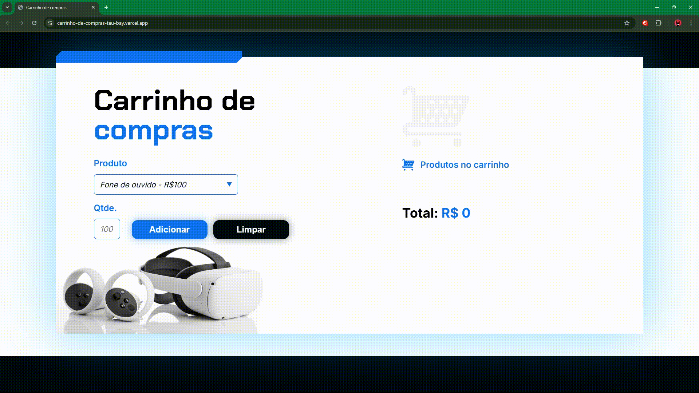
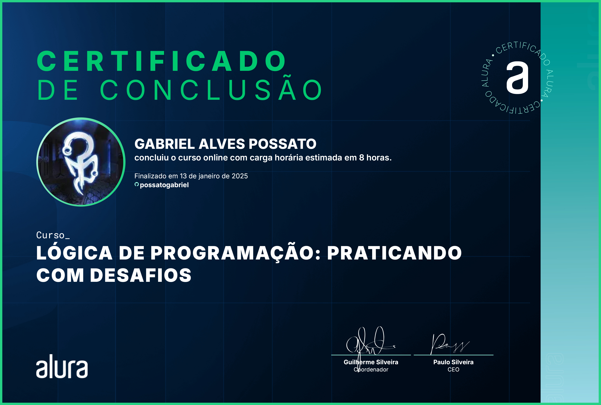

# 🛒 Carrinho de Compras

## 📰 Descrição

Terceiro projeto do último curso de Lógica de Programação da Alura

Esse projeto simula um **carrinho de compras**, onde você pode adicionar itens e a sua quantidade, que são mostrados na tela, assim como seu valor (total e individual para cada produto)

## 🔗 Link para vizualização

## 💻 Tecnologias Utilizadas
`Trabalhado durante o curso:`

 

`Desenvolvido anteriormente pela Alura:`

 

## 🏅 Certificado de Conclusão 

## 🙋 Autores
[    Gabriel Possato ](https://github.com/possatogabriel)
 
 

    

